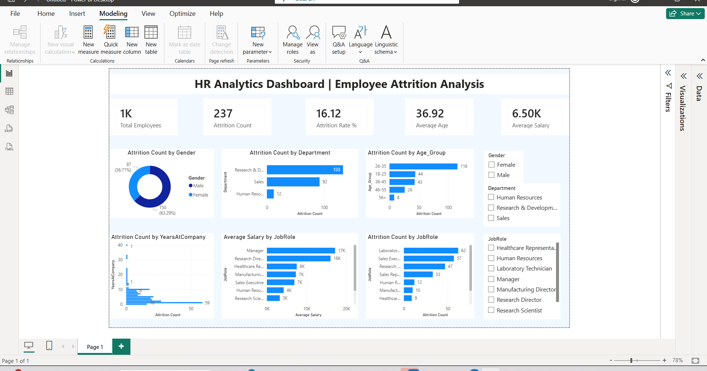
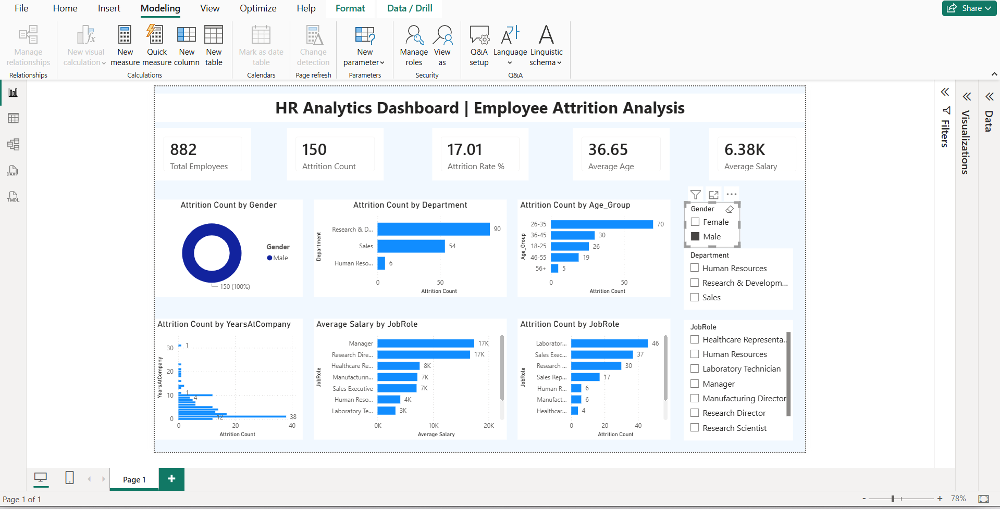

# HR Analytics Dashboard (Power BI)

## 📊 Project Overview

This project analyzes employee attrition data using Power BI to identify key workforce trends and help HR teams improve employee retention strategies.

The dashboard provides insights into employee demographics, job roles, salary distribution, and attrition patterns.

---

## 🎯 Business Problem

Organizations often face challenges in understanding why employees leave. This project helps answer:

* Which departments have the highest attrition?
* What age group is most likely to leave?
* How does salary affect employee retention?
* Which job roles are most impacted?

---

## 📈 Key Insights

* Sales department shows the highest attrition rate.
* Employees aged 26–35 are the most likely to leave.
* Lower salary groups show higher attrition trends.
* Employees with fewer years at the company tend to leave earlier.

---

## 📊 Dashboard Features

* Total Employees KPI
* Attrition Rate Analysis
* Department-wise Attrition
* Job Role Analysis
* Age Group Distribution
* Salary Analysis
* Tenure (Years at Company) Analysis
* Interactive Slicers

---

## 🛠️ Tools Used

* Power BI
* DAX (Data Analysis Expressions)
* Data Cleaning
* Data Visualization

---

## 🖼️ Dashboard Preview

### Screenshot 1

### Screenshot 2

---

## 📌 Outcome

This dashboard helps HR teams make data-driven decisions to improve employee retention and workforce planning.
